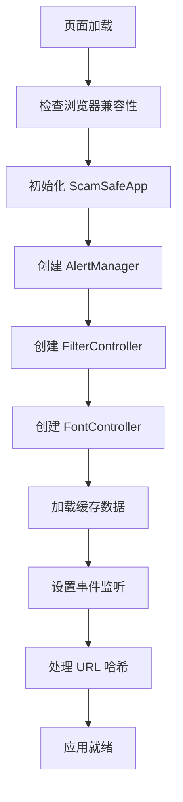
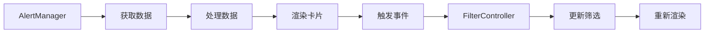
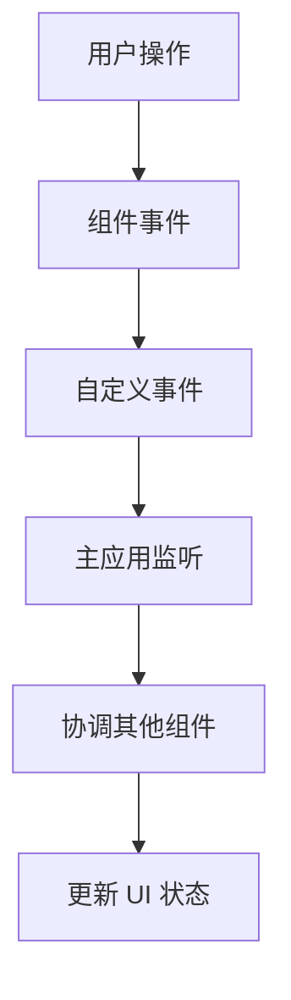

# ScamSafe 前端项目结构详细说明

## 文件组织架构

### 🎯 核心页面文件
- **`index.html`** - 主页面入口文件
    - 响应式 HTML 结构
    - 语义化标签设计
    - SEO 优化元标签
    - 无障碍 ARIA 标签

### 🎨 样式文件架构 (`css/`)

#### 1. `variables.css` - 设计系统变量
```css
/* 功能说明 */
- CSS 自定义属性定义
- 颜色体系：专业深色主题
- 字体缩放系统：支持动态调节
- 间距规范：基于 rem 的响应式间距
- 断点定义：移动优先的响应式断点
- 动画缓动函数：统一的过渡效果
```

#### 2. `base.css` - 基础样式层
```css
/* 功能说明 */
- CSS 重置和规范化
- 基础排版样式
- 表单元素样式
- 滚动条美化
- 选择文本样式
- 无障碍焦点样式
```

#### 3. `components.css` - 组件样式层
```css
/* 包含组件 */
- 导航栏 (.navbar)
- 按钮系统 (.btn-*)
- 筛选标签 (.filter-tab)
- 卡片组件 (.card)
- 徽章组件 (.badge)
- 威胁图标 (.threat-icon)
- 加载和错误状态
```

#### 4. `layout.css` - 布局样式层
```css
/* 布局系统 */
- Hero 区域布局
- 网格系统 (.alerts-grid)
- 容器布局 (.container)
- Flexbox 工具类
- 间距工具类
- 页脚布局
```

#### 5. `responsive.css` - 响应式适配
```css
/* 断点系统 */
- 1024px: 平板横向
- 768px: 平板竖向
- 640px: 大屏手机
- 480px: 小屏手机
- 打印样式优化
```

### 🚀 JavaScript 架构 (`js/`)

#### 核心配置
- **`config.js`** - 全局配置管理
  ```javascript
  // 主要配置项
  - 应用信息和版本
  - API 端点配置
  - 功能开关
  - 威胁类型定义
  - 严重等级配置
  - 本地存储键名
  - 错误消息定义
  ```

- **`utils.js`** - 工具函数库
  ```javascript
  // 工具模块
  - DOM 操作工具
  - 字符串处理
  - 日期时间处理
  - 本地存储管理
  - 网络请求封装
  - 数组处理工具
  - 数据验证
  - 防抖和节流
  ```

#### 组件系统 (`js/components/`)

##### 1. `fontController.js` - 字体控制组件
```javascript
/* 核心功能 */
class FontController {
  // 字体大小控制 (小/正常/大)
  // 键盘快捷键支持 (Ctrl +/-/0)
  // 本地存储记忆
  // 预览功能（鼠标悬停）
  // 无障碍屏幕阅读器支持
  // 视觉反馈动画
}
```

##### 2. `filterController.js` - 筛选控制组件
```javascript
/* 核心功能 */
class FilterController {
  // 威胁类型筛选 (全部/短信/邮件/电话/投资)
  // 筛选历史记录
  // URL 哈希同步
  // 键盘导航支持
  // 筛选预览功能
  // 结果统计显示
  // 动画过渡效果
}
```

##### 3. `alertManager.js` - 警报管理组件
```javascript
/* 核心功能 */
class AlertManager {
  // 数据获取和缓存
  // 自动刷新机制
  // 离线支持
  // 错误处理和重试
  // 卡片动态渲染
  // 时间戳更新
  // 交互事件处理
  // 性能优化（文档片段）
}
```

#### 主程序入口
- **`main.js`** - 应用程序主控制器
  ```javascript
  /* 核心功能 */
  class ScamSafeApp {
    // 应用初始化流程
    // 组件协调管理
    // 全局事件处理
    // 导航路由管理
    // 错误处理和恢复
    // 浏览器兼容性检查
    // 分析事件追踪
    // 生命周期管理
  }
  ```

## 🔄 组件交互流程

### 应用启动流程


### 数据流动


### 组件通信


## 📱 响应式设计策略

### 断点系统
| 设备类型 | 屏幕宽度 | 布局特点 |
|---------|---------|---------|
| 桌面端 | > 1024px | 多列网格，完整导航 |
| 平板横向 | 768-1024px | 双列网格，紧凑导航 |
| 平板竖向 | 640-768px | 单列网格，折叠导航 |
| 大屏手机 | 480-640px | 垂直布局，触摸优化 |
| 小屏手机 | < 480px | 最小化界面，手势友好 |

### 适配策略
- **移动优先**: 从小屏幕开始设计，逐步增强
- **触摸友好**: 按钮最小 44px，间距充足
- **内容优先**: 关键信息优先显示
- **性能优化**: 移动端资源压缩

## 🛠️ 开发工作流程

### 1. 环境配置
```bash
# 1. 安装 Node.js (>= 16.0.0)
# 2. 克隆项目
git clone <repository>

# 3. 安装依赖
npm install

# 4. 启动开发服务器
npm run dev
```

### 2. 开发模式特性
- **热重载**: 文件修改自动刷新
- **Mock 数据**: 模拟 API 数据
- **开发工具**: 浏览器开发者工具集成
- **错误提示**: 详细的错误信息

### 3. 代码规范
- **ESLint**: JavaScript 代码检查
- **Prettier**: 代码格式化
- **HTML Validate**: HTML 结构验证
- **Lighthouse**: 性能和无障碍检查

### 4. 构建部署
```bash
# 构建生产版本
npm run build

# 生成的文件结构
dist/
├── css/
│   └── app.min.css     # 压缩的样式文件
├── js/
│   └── app.min.js      # 压缩的脚本文件
├── assets/             # 优化的静态资源
└── index.html          # 优化的 HTML 文件
```

## 🎯 性能优化策略

### JavaScript 优化
- **模块化加载**: 按需引入组件
- **事件委托**: 减少事件监听器数量
- **防抖节流**: 优化高频事件处理
- **内存管理**: 及时清理事件监听器

### CSS 优化
- **关键路径**: 内联关键 CSS
- **选择器优化**: 避免复杂嵌套
- **动画优化**: 使用 transform 和 opacity
- **字体优化**: 预加载关键字体

### 资源优化
- **图片优化**: WebP 格式，懒加载
- **缓存策略**: 版本化资源文件
- **CDN 加速**: 第三方资源 CDN
- **压缩合并**: Gzip 压缩，文件合并

## 🔒 安全考虑

### 前端安全
- **XSS 防护**: HTML 转义，CSP 策略
- **CSRF 防护**: SameSite Cookie 策略
- **数据验证**: 客户端输入验证
- **敏感信息**: 避免硬编码敏感数据

### 内容安全策略
```html
<meta http-equiv="Content-Security-Policy" 
      content="default-src 'self'; 
               script-src 'self' 'unsafe-inline' cdnjs.cloudflare.com;
               style-src 'self' 'unsafe-inline' cdnjs.cloudflare.com;">
```

## 📈 监控和分析

### 性能监控
- **页面加载时间**
- **交互响应时间**
- **资源加载状态**
- **错误率统计**

### 用户行为分析
- **功能使用频率**
- **筛选器使用情况**
- **字体大小偏好**
- **设备和浏览器分布**

## 🚀 未来扩展计划

### 功能扩展
- **多语言支持**: i18n 国际化
- **主题切换**: 明/暗主题
- **个性化设置**: 用户偏好保存
- **高级筛选**: 时间范围、严重等级筛选

### 技术升级
- **PWA 支持**: 离线使用，推送通知
- **WebComponents**: 组件标准化
- **TypeScript**: 类型安全
- **现代框架**: React/Vue 重构考虑

---

这个项目结构为您提供了一个完整、专业的前端开发框架，可以直接用于开发和部署。所有组件都经过精心设计，具有良好的可维护性和扩展性。